# Diagramas de Arquitectura C4

> El modelo C4 (Context, Container, Component, Code) provee cuatro niveles de abstracción
> para documentar la arquitectura de software — desde el contexto del negocio hasta el código.
>
> **Referencias:**
> - C4 Model — Simon Brown: [c4model.com](https://c4model.com/)
> - Soporte Mermaid C4: [mermaid.js.org/syntax/c4](https://mermaid.js.org/syntax/c4.html)

---

## Nivel 1 — System Context Diagram

> Muestra el sistema desde la perspectiva del negocio: quiénes son los usuarios y con qué sistemas externos interactúa.

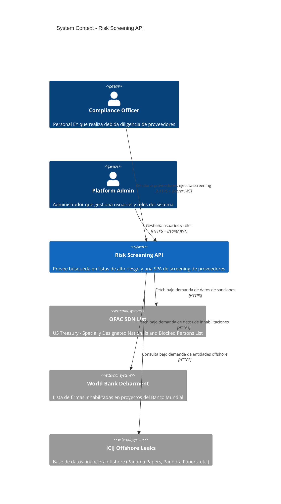

---

## Nivel 2 — Container Diagram

> Muestra los contenedores (procesos, bases de datos, frontends) que componen el sistema y cómo se comunican.

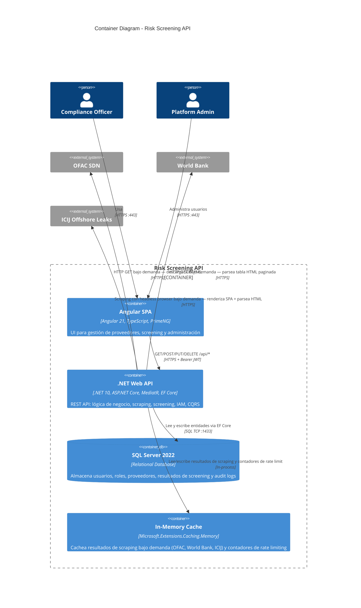

> **Nota:** La Fase 1 usa scraping bajo demanda (sin worker en background). Un worker `BackgroundService` de pre-población está planificado para la Fase 2 (solo OFAC y World Bank; ICIJ permanece bajo demanda de forma permanente).

---

## Nivel 3 — Component Diagram (Web API)

> Muestra los componentes internos del contenedor principal (.NET Web API) y sus responsabilidades.

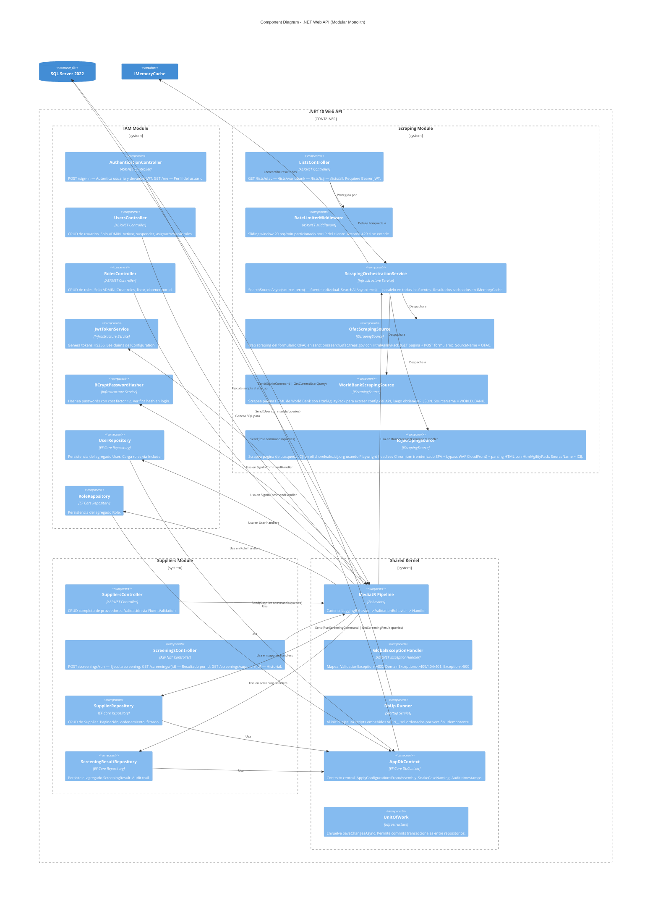

---

## Nivel 4 — Code Diagram (Modelo de Dominio — Shared Kernel)

> Muestra todas las clases fundacionales del Shared Kernel (`Shared/Domain`, `Shared/Application`, `Shared/Infrastructure`, `Shared/Interfaces`) reutilizadas por todos los módulos.
> Dividido en seis sub-secciones: Modelo de Dominio, Repositorios, Excepciones, Aplicación, Infraestructura e Interfaces.

---

### Shared Kernel — Modelo de Dominio

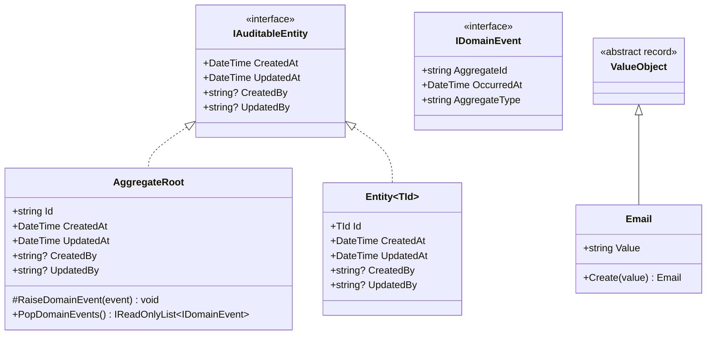

---

### Shared Kernel — Repositorios de Dominio

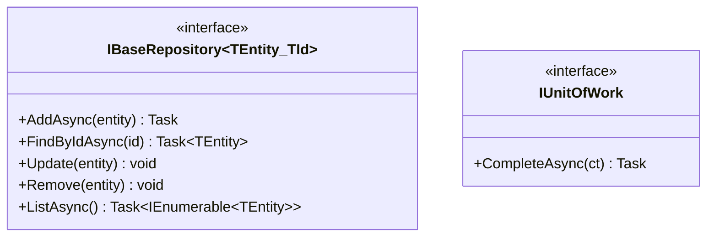

---

### Shared Kernel — Excepciones de Dominio

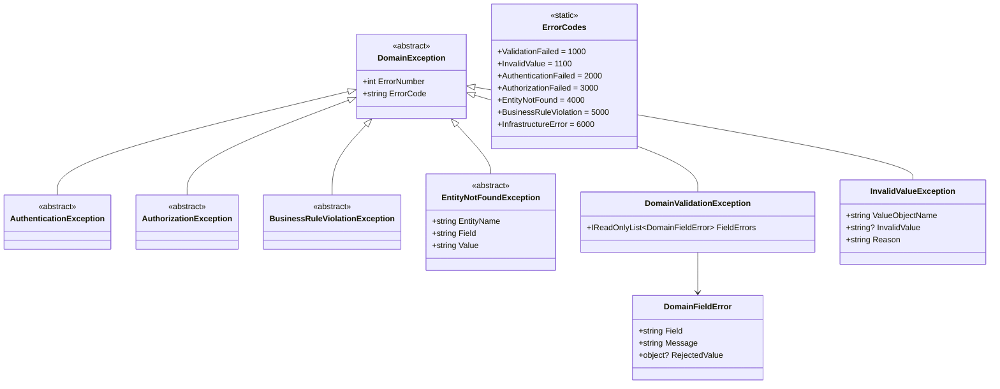

---

### Shared Kernel — Aplicación

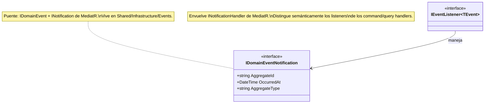

---

### Shared Kernel — Infraestructura

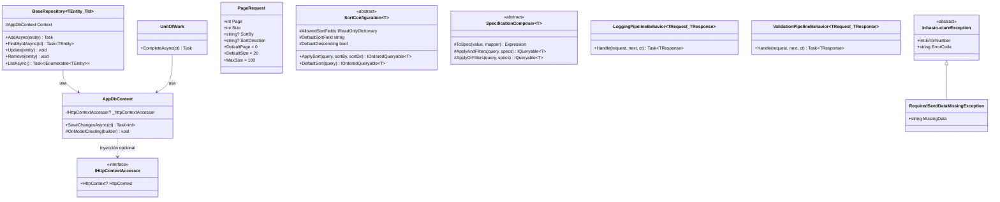

---

### Shared Kernel — Interfaces (REST)

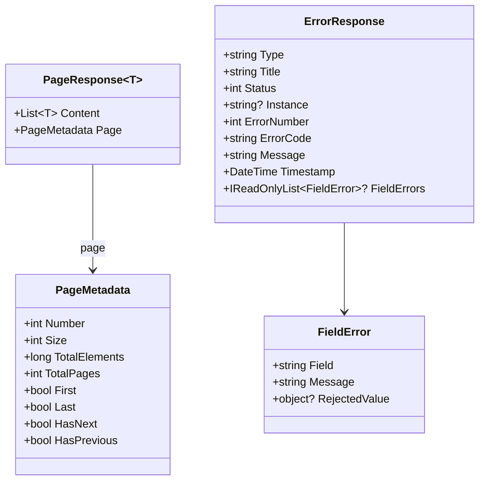

> **`[Shared/Domain]`**: `IAuditableEntity`, `IDomainEvent`, `AggregateRoot`, `Entity<TId>`, `ValueObject`, `Email`, `IBaseRepository<T,TId>`, `IUnitOfWork`, `DomainException` hierarchy, `ErrorCodes`
> **`[Shared/Application]`**: `IEventListener<TEvent>`
> **`[Shared/Infrastructure]`**: `IDomainEventNotification`, `AppDbContext`, `BaseRepository<T,TId>`, `UnitOfWork`, `PageRequest`, `SortConfiguration<T>`, `SpecificationComposer<T>`, `LoggingPipelineBehavior`, `ValidationPipelineBehavior`, `InfrastructureException` hierarchy
> **`[Shared/Interfaces]`**: `PageResponse<T>`, `PageMetadata`, `ErrorResponse`, `FieldError`

---

## Nivel 4 — Code Diagram (Modelo de Dominio IAM)

> Muestra las clases principales del modelo de dominio del módulo IAM.
> `AggregateRoot` y `Email` viven en `Shared/Domain` y son reutilizados por todos los módulos.
> `Username`, `Password` y `AccountStatus` son Value Objects propios del módulo IAM.

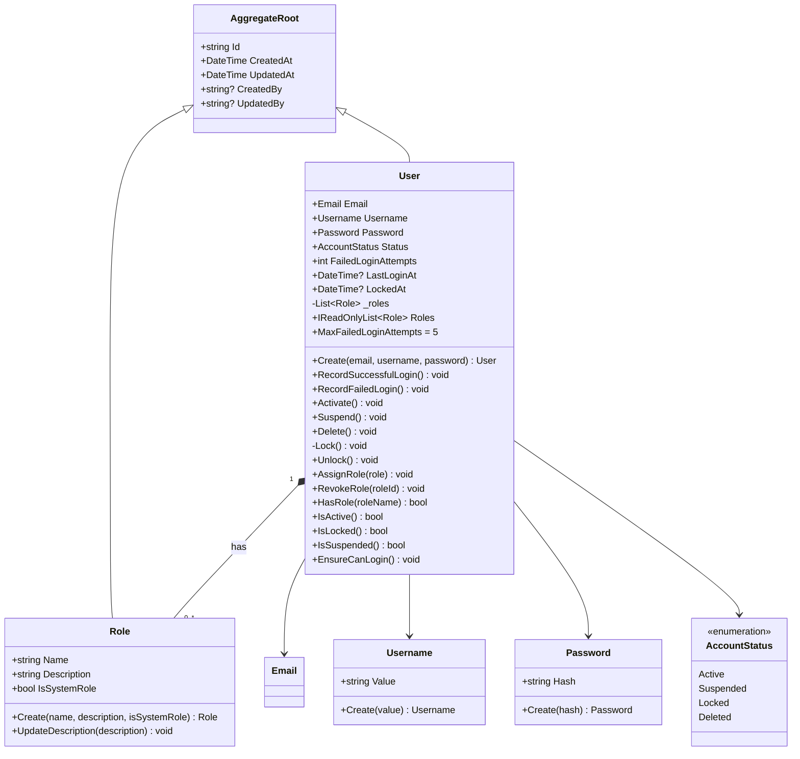

> **`[Shared/Domain]`**: `AggregateRoot`, `Email`
> **`[IAM/Domain]`**: `Username`, `Password`, `AccountStatus` (Value Objects)

---

## Nivel 4 — Code Diagram (Modelo de Dominio — Módulo Scraping)

> Muestra las clases clave de las capas de dominio e infraestructura del módulo Scraping.
> El módulo Scraping es **stateless** — nunca escribe en la base de datos. Los resultados se sirven únicamente desde `IMemoryCache`.
> `PageResponse<T>` y `PageMetadata` viven en `Shared/Interfaces`. `PageRequest` vive en `Shared/Infrastructure`.

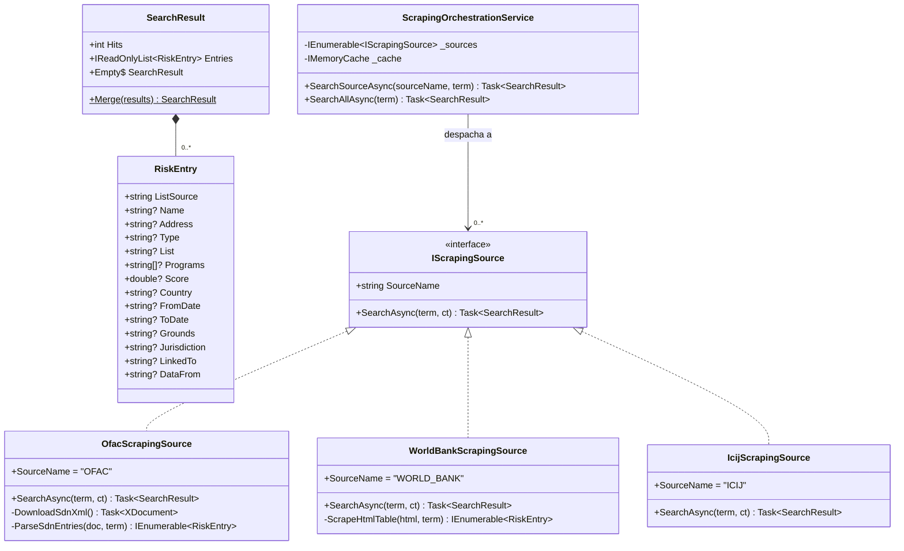

> **`[Scraping/Domain]`**: `SearchResult`, `RiskEntry`
> **`[Scraping/Infrastructure]`**: `IScrapingSource`, `OfacScrapingSource`, `WorldBankScrapingSource`, `IcijScrapingSource`, `ScrapingOrchestrationService`

---

## Nivel 4 — Code Diagram (Modelo de Dominio — Módulo Suppliers)

> Muestra las clases clave del modelo de dominio del módulo Suppliers.
> `AggregateRoot` proviene de `Shared/Domain`.
> `Supplier` y `ScreeningResult` son `AggregateRoot`s independientes.

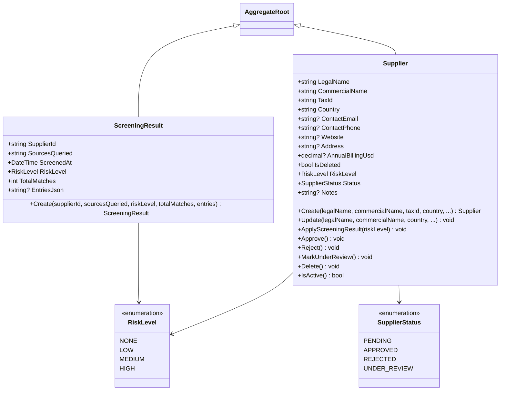

> **`[Shared/Domain]`**: `AggregateRoot`

---

## Diagrama de Despliegue — Azure Container Apps

> Muestra la topologia fisica de despliegue en Azure: Container Apps para frontend y backend, Azure SQL Database para persistencia, Docker Hub como registro de contenedores.
>
> Para instrucciones paso a paso, ver [Guia de Despliegue Azure](../deployment/azure-deployment.es.md).

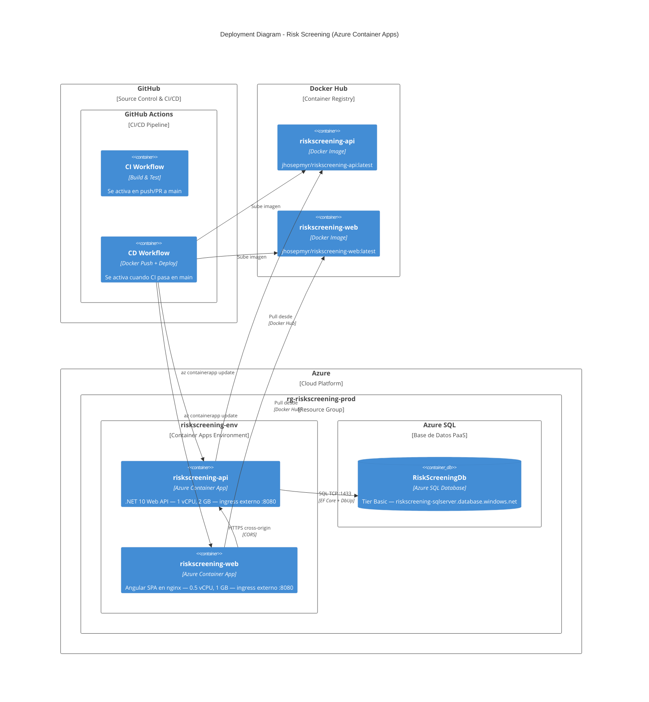

> **Puntos clave:**
> - Ambos contenedores tienen `--ingress external` con dominios HTTPS separados `*.azurecontainerapps.io`
> - CORS se configura en el backend via la variable de entorno `Cors__AllowedOrigins__0`
> - CI/CD usa el patron `workflow_run`: CD se activa solo despues de que CI pasa en `main`

---

## Notas sobre el Modelo C4

| Nivel | Audiencia | Herramienta |
|-------|----------|-------------|
| L1 Context | Stakeholders de negocio | Mermaid (en README y este archivo) |
| L2 Container | Arquitectos, Tech Leads | Mermaid (en README y este archivo) |
| L3 Component | Desarrolladores | Mermaid (en este archivo) |
| L4 Code | Desarrolladores | Mermaid classDiagram / IDE |

**Herramientas alternativas para diagramas C4:**
- [Structurizr Lite](https://structurizr.com/help/lite) — DSL propio, genera todos los niveles
- [C4-PlantUML](https://github.com/plantuml-stdlib/C4-PlantUML) — para equipos que usan PlantUML
- [draw.io / diagrams.net](https://draw.io) — con la shape library de C4
