# C4 Architecture Diagrams

> The C4 model (Context, Container, Component, Code) provides four levels of abstraction
> for documenting software architecture — from business context down to code.
>
> **References:**
> - C4 Model — Simon Brown: [c4model.com](https://c4model.com/)
> - Mermaid C4 support: [mermaid.js.org/syntax/c4](https://mermaid.js.org/syntax/c4.html)

---

## Level 1 — System Context Diagram

> Shows the system from a business perspective: who the users are and which external systems it interacts with.

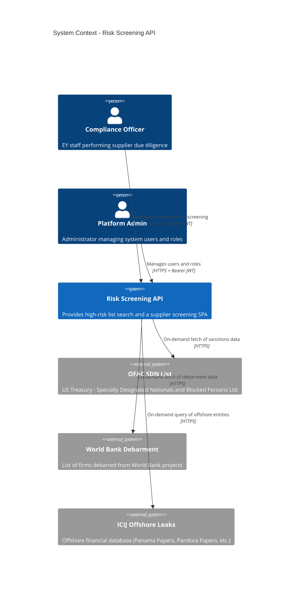

---

## Level 2 — Container Diagram

> Shows the containers (processes, databases, frontends) that make up the system and how they communicate.

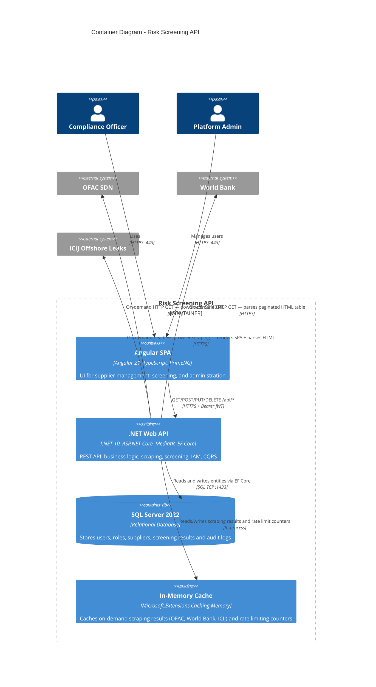

> **Note:** Phase 1 uses on-demand scraping (no background worker). A `BackgroundService` pre-population worker is planned for Phase 2 (OFAC and World Bank only; ICIJ remains on-demand permanently).

---

## Level 3 — Component Diagram (Web API)

> Shows the internal components of the main container (.NET Web API) and their responsibilities.

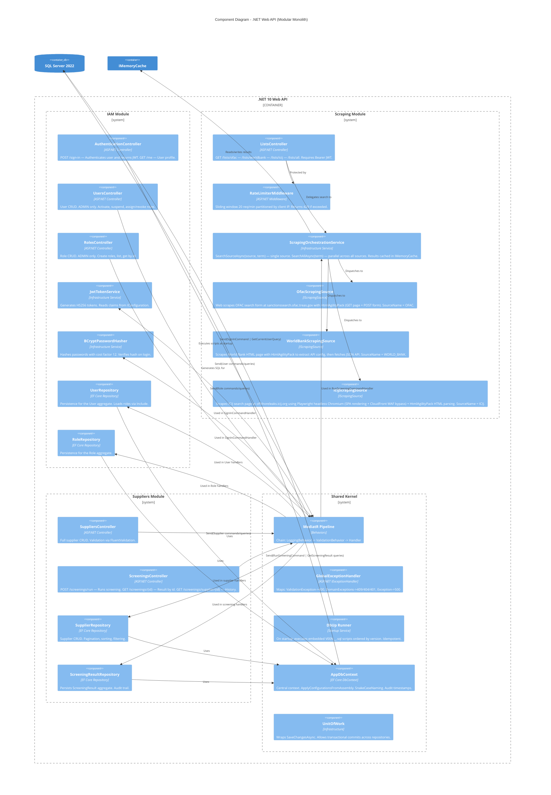

---

## Level 4 — Code Diagram (Shared Kernel Domain Model)

> Shows all foundational classes of the Shared Kernel (`Shared/Domain`, `Shared/Application`, `Shared/Infrastructure`, `Shared/Interfaces`) reused across all modules.
> Divided into six sub-sections: Domain Model, Repositories, Exceptions, Application, Infrastructure, and Interfaces.

---

### Shared Kernel — Domain Model

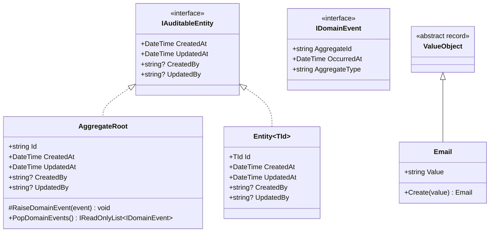

---

### Shared Kernel — Domain Repositories

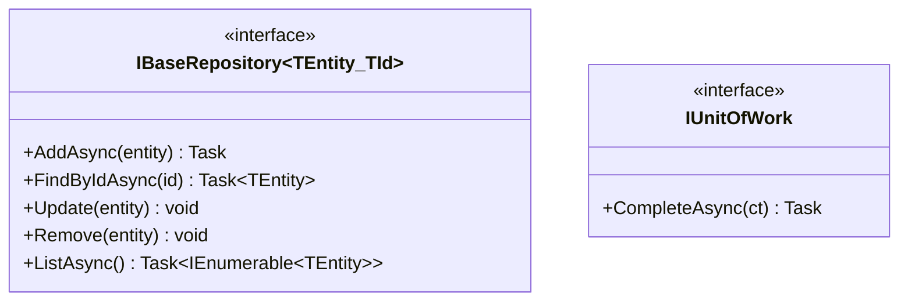

---

### Shared Kernel — Domain Exceptions

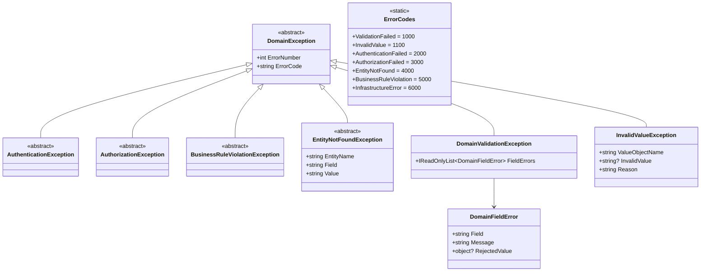

---

### Shared Kernel — Application

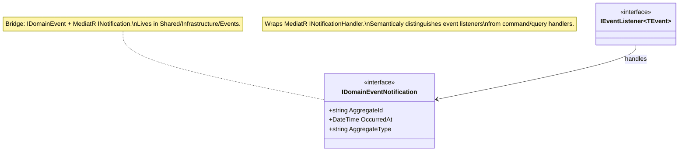

---

### Shared Kernel — Infrastructure

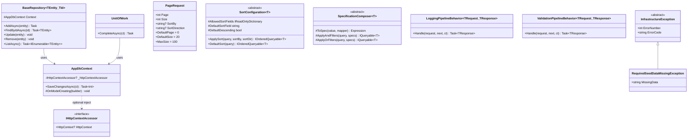

---

### Shared Kernel — Interfaces (REST)

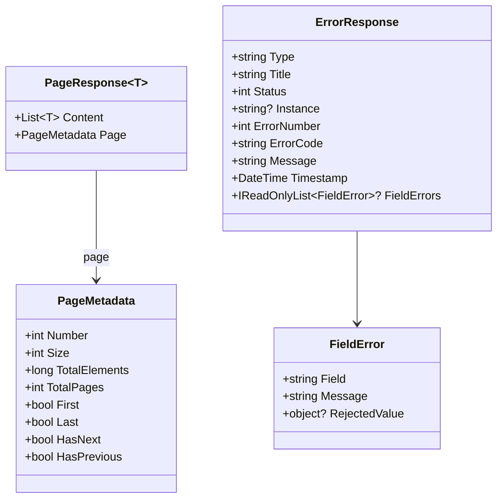

> **`[Shared/Domain]`**: `IAuditableEntity`, `IDomainEvent`, `AggregateRoot`, `Entity<TId>`, `ValueObject`, `Email`, `IBaseRepository<T,TId>`, `IUnitOfWork`, `DomainException` hierarchy, `ErrorCodes`
> **`[Shared/Application]`**: `IEventListener<TEvent>`
> **`[Shared/Infrastructure]`**: `IDomainEventNotification`, `AppDbContext`, `BaseRepository<T,TId>`, `UnitOfWork`, `PageRequest`, `SortConfiguration<T>`, `SpecificationComposer<T>`, `LoggingPipelineBehavior`, `ValidationPipelineBehavior`, `InfrastructureException` hierarchy
> **`[Shared/Interfaces]`**: `PageResponse<T>`, `PageMetadata`, `ErrorResponse`, `FieldError`

---

## Level 4 — Code Diagram (IAM Domain Model)

> Shows the main classes of the IAM module's domain model.
> `AggregateRoot` and `Email` live in `Shared/Domain` and are reused across modules.
> `Username`, `Password`, and `AccountStatus` are IAM-specific Value Objects.

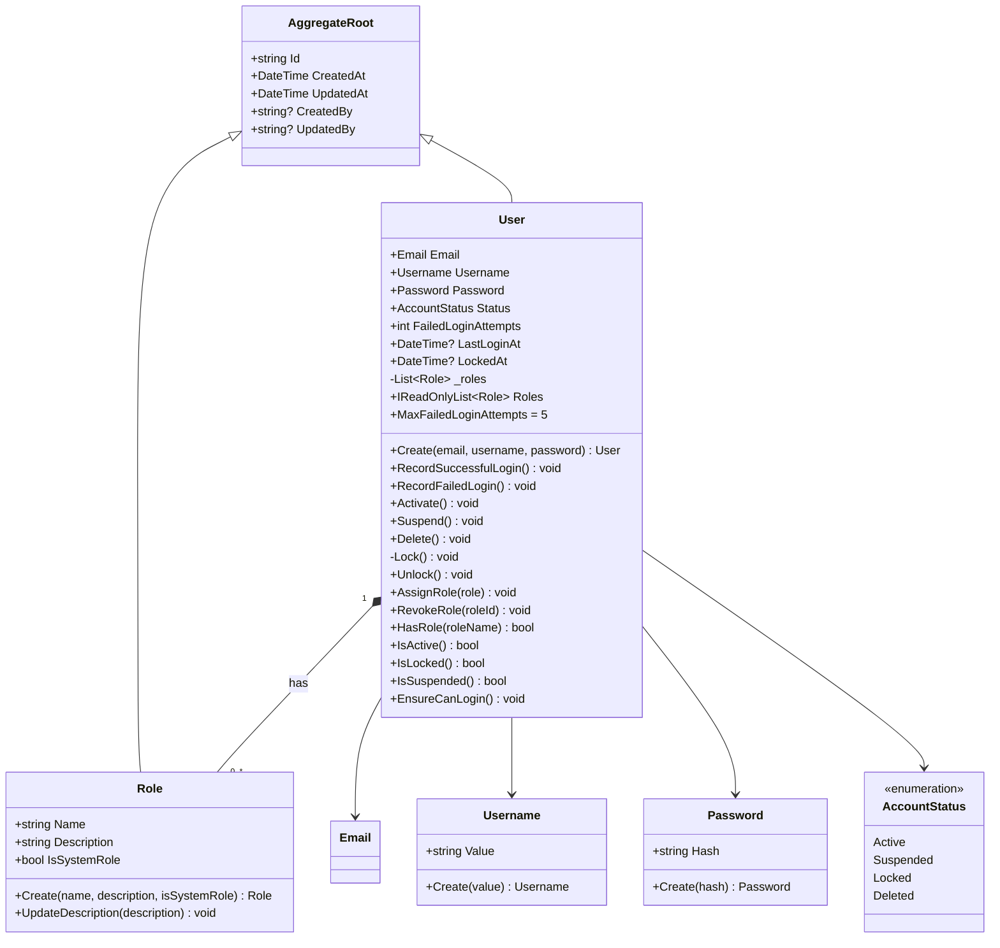

> **`[Shared/Domain]`**: `AggregateRoot`, `Email`
> **`[IAM/Domain]`**: `Username`, `Password`, `AccountStatus` (Value Objects)

---

## Level 4 — Code Diagram (Scraping Module Domain Model)

> Shows the key classes of the Scraping module's domain and infrastructure layers.
> The Scraping module is **stateless** — it never writes to the database. Results are served from `IMemoryCache` only.
> `PageResponse<T>` and `PageMetadata` live in `Shared/Interfaces`. `PageRequest` lives in `Shared/Infrastructure`.

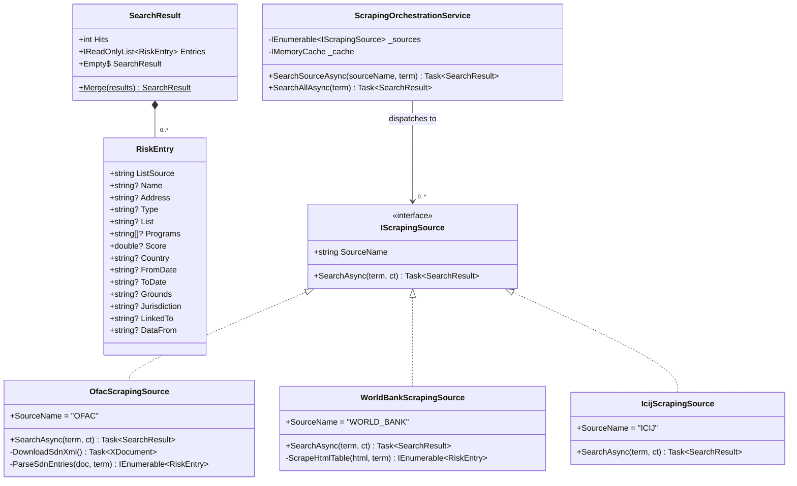

> **`[Scraping/Domain]`**: `SearchResult`, `RiskEntry`
> **`[Scraping/Infrastructure]`**: `IScrapingSource`, `OfacScrapingSource`, `WorldBankScrapingSource`, `IcijScrapingSource`, `ScrapingOrchestrationService`

---

## Level 4 — Code Diagram (Suppliers Module Domain Model)

> Shows the key classes of the Suppliers module's domain model.
> `AggregateRoot` comes from `Shared/Domain`.
> `Supplier` and `ScreeningResult` are independent `AggregateRoot`s.

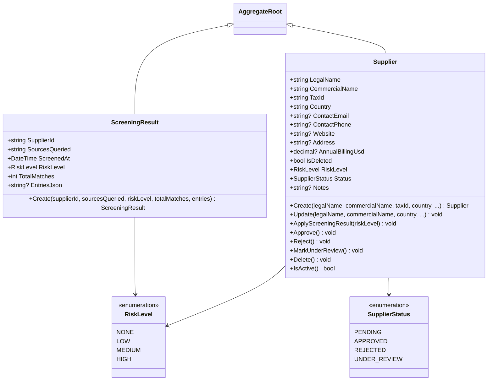

> **`[Shared/Domain]`**: `AggregateRoot`

---

## Deployment Diagram — Azure Container Apps

> Shows the physical deployment topology on Azure: Container Apps for frontend and backend, Azure SQL Database for persistence, Docker Hub as the container registry.
>
> For step-by-step deployment instructions, see [Azure Deployment Guide](../deployment/azure-deployment.md).

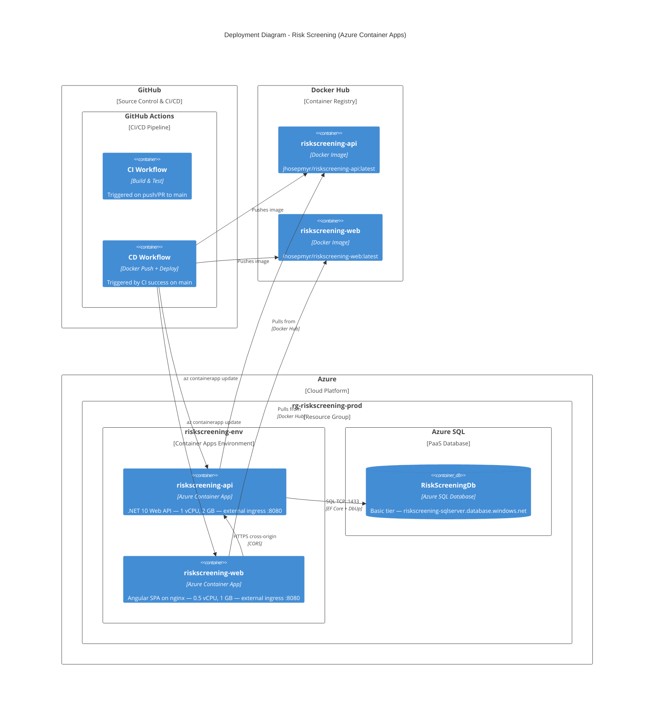

> **Key points:**
> - Both containers have `--ingress external` with separate `*.azurecontainerapps.io` HTTPS domains
> - CORS is configured on the backend via `Cors__AllowedOrigins__0` env var
> - CI/CD uses the `workflow_run` pattern: CD triggers only after CI passes on `main`

---

## C4 Model Notes

| Level | Audience | Tool |
|-------|----------|------|
| L1 Context | Business stakeholders | Mermaid (in README and this file) |
| L2 Container | Architects, Tech Leads | Mermaid (in README and this file) |
| L3 Component | Developers | Mermaid (in this file) |
| L4 Code | Developers | Mermaid classDiagram / IDE |

**Alternative tools for C4 diagrams:**
- [Structurizr Lite](https://structurizr.com/help/lite) — proprietary DSL, generates all levels
- [C4-PlantUML](https://github.com/plantuml-stdlib/C4-PlantUML) — for teams using PlantUML
- [draw.io / diagrams.net](https://draw.io) — with the C4 shape library
