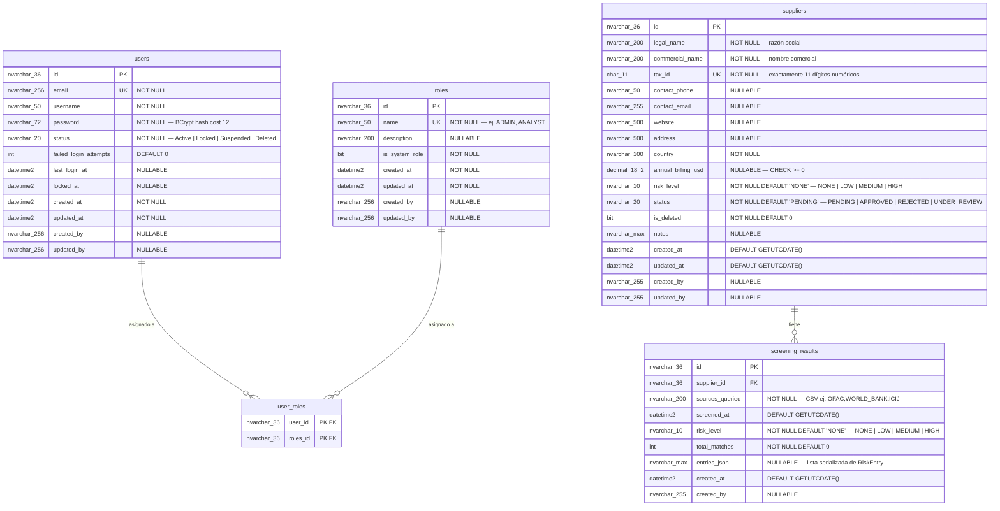

# Esquema de Base de Datos

> Diagrama Entidad-Relación y definición de tablas para la base de datos del Risk Screening API.
>
> **Base de datos:** SQL Server 2022
> **Herramienta de migraciones:** DbUp `7.2.0` — scripts SQL versionados (`V001__...sql`) embebidos en el assembly y ejecutados al inicio de la API.

---

## Diagrama Entidad-Relación

---

## Definición de Tablas

### `roles`

Almacena los roles del sistema. Sembrado al inicio (`ADMIN`, `ANALYST`).

| Columna | Tipo | Nullable | Restricciones | Notas |
|---------|------|----------|---------------|-------|
| `id` | `NVARCHAR(36)` | No | PK | Default `NEWID()` |
| `name` | `NVARCHAR(50)` | No | UNIQUE | Ej. `ADMIN`, `ANALYST` |
| `description` | `NVARCHAR(200)` | Sí | — | Descripción legible |
| `is_system_role` | `BIT` | No | — | Los roles del sistema no pueden eliminarse |
| `created_at` | `DATETIME2` | No | — | Asignado por EF Core al guardar |
| `updated_at` | `DATETIME2` | No | — | Asignado por EF Core al guardar |
| `created_by` | `NVARCHAR(256)` | Sí | — | Username del claim JWT |
| `updated_by` | `NVARCHAR(256)` | Sí | — | Username del claim JWT |

---

### `users`

Almacena las cuentas de usuario. Sembrado con un usuario `admin` por defecto al inicio.

| Columna | Tipo | Nullable | Restricciones | Notas |
|---------|------|----------|---------------|-------|
| `id` | `NVARCHAR(36)` | No | PK | |
| `email` | `NVARCHAR(256)` | No | UNIQUE | Minúsculas, validado |
| `username` | `NVARCHAR(50)` | No | INDEX | Alfanumérico + guion bajo |
| `password` | `NVARCHAR(72)` | No | — | Hash BCrypt, cost factor 12 (longitud máxima BCrypt) |
| `status` | `NVARCHAR(20)` | No | CHECK | `Active` \| `Locked` \| `Suspended` \| `Deleted` |
| `failed_login_attempts` | `INT` | No | DEFAULT `0` | Bloqueado tras 5 fallos consecutivos |
| `last_login_at` | `DATETIME2` | Sí | — | Timestamp UTC |
| `locked_at` | `DATETIME2` | Sí | — | Timestamp UTC |
| `created_at` | `DATETIME2` | No | — | Asignado por EF Core al guardar |
| `updated_at` | `DATETIME2` | No | — | Asignado por EF Core al guardar |
| `created_by` | `NVARCHAR(256)` | Sí | — | Username del claim JWT |
| `updated_by` | `NVARCHAR(256)` | Sí | — | Username del claim JWT |

---

### `user_roles`

Tabla de unión muchos-a-muchos entre `users` y `roles`.

| Columna | Tipo | Nullable | Restricciones | Notas |
|---------|------|----------|---------------|-------|
| `user_id` | `NVARCHAR(36)` | No | PK, FK → `users.id` | |
| `roles_id` | `NVARCHAR(36)` | No | PK, FK → `roles.id` | |

> Clave primaria compuesta: `(user_id, roles_id)`

---

### `suppliers`

Almacena los registros de proveedores gestionados por los oficiales de compliance.
El borrado lógico usa `is_deleted = 1` — independiente del `status` de negocio.

| Columna | Tipo | Nullable | Restricciones | Notas |
|---------|------|----------|---------------|-------|
| `id` | `NVARCHAR(36)` | No | PK | Default `NEWID()` |
| `legal_name` | `NVARCHAR(200)` | No | — | Razón social |
| `commercial_name` | `NVARCHAR(200)` | No | — | Nombre comercial |
| `tax_id` | `CHAR(11)` | No | UNIQUE, CHECK | Exactamente 11 dígitos numéricos (RUC) |
| `contact_phone` | `NVARCHAR(50)` | Sí | — | Teléfono de contacto principal |
| `contact_email` | `NVARCHAR(255)` | Sí | — | Email de contacto principal |
| `website` | `NVARCHAR(500)` | Sí | — | Sitio web de la empresa |
| `address` | `NVARCHAR(500)` | Sí | — | Dirección registrada |
| `country` | `NVARCHAR(100)` | No | — | País de registro |
| `annual_billing_usd` | `DECIMAL(18,2)` | Sí | CHECK `>= 0` | Facturación anual en dólares |
| `risk_level` | `NVARCHAR(10)` | No | CHECK, DEFAULT `'NONE'` | `NONE` \| `LOW` \| `MEDIUM` \| `HIGH` |
| `status` | `NVARCHAR(20)` | No | CHECK, DEFAULT `'PENDING'` | `PENDING` \| `APPROVED` \| `REJECTED` \| `UNDER_REVIEW` |
| `is_deleted` | `BIT` | No | DEFAULT `0` | Flag de borrado lógico — independiente del estado de compliance |
| `notes` | `NVARCHAR(MAX)` | Sí | — | Notas opcionales del analista |
| `created_at` | `DATETIME2` | No | DEFAULT `GETUTCDATE()` | |
| `updated_at` | `DATETIME2` | No | DEFAULT `GETUTCDATE()` | |
| `created_by` | `NVARCHAR(255)` | Sí | — | Username del claim JWT |
| `updated_by` | `NVARCHAR(255)` | Sí | — | Username del claim JWT |

> Índices: `IX_suppliers_risk_level`, `IX_suppliers_status`, `IX_suppliers_country`, `IX_suppliers_is_deleted`

---

### `screening_results`

Almacena el resultado de cada ejecución de screening para un proveedor.
**Inmutable tras la creación** — sin columna `updated_at`.

| Columna | Tipo | Nullable | Restricciones | Notas |
|---------|------|----------|---------------|-------|
| `id` | `NVARCHAR(36)` | No | PK | Default `NEWID()` |
| `supplier_id` | `NVARCHAR(36)` | No | FK → `suppliers.id` CASCADE DELETE | |
| `sources_queried` | `NVARCHAR(200)` | No | — | CSV de fuentes consultadas, ej. `"OFAC,WORLD_BANK,ICIJ"` |
| `screened_at` | `DATETIME2` | No | DEFAULT `GETUTCDATE()` | Timestamp UTC de la ejecución |
| `risk_level` | `NVARCHAR(10)` | No | CHECK, DEFAULT `'NONE'` | `NONE` \| `LOW` \| `MEDIUM` \| `HIGH` |
| `total_matches` | `INT` | No | DEFAULT `0` | Total de coincidencias en todas las fuentes |
| `entries_json` | `NVARCHAR(MAX)` | Sí | — | Array JSON serializado de objetos `RiskEntry` coincidentes |
| `created_at` | `DATETIME2` | No | DEFAULT `GETUTCDATE()` | |
| `created_by` | `NVARCHAR(255)` | Sí | — | Username del claim JWT |

> Índices: `IX_screening_results_supplier_id`, `IX_screening_results_screened_at DESC`, `IX_screening_results_risk_level`

---

## Mapa de Scripts de Migración

| Script | Descripción |
|--------|-------------|
| `V001__create_roles_table.sql` | Crea la tabla `roles` |
| `V002__create_users_table.sql` | Crea la tabla `users` |
| `V003__create_user_roles_table.sql` | Crea la tabla de unión `user_roles` |
| `V005__create_suppliers_table.sql` | Crea la tabla `suppliers` |
| `V006__create_screening_results_table.sql` | Crea la tabla `screening_results` |

> V004 fue reservado para la tabla `api_keys` (autenticación por API Key) que fue eliminada del alcance.
> DbUp maneja huecos en la numeración de versiones sin inconvenientes — los scripts se rastrean por nombre de archivo, no por número de secuencia.
>
> Todos los scripts están embebidos como `EmbeddedResource` en el assembly y ejecutados por DbUp al inicio de la API.
> Ver [ADR-0004](../adr/0004-sql-migration-scripts.md) para la estrategia completa de migraciones.
