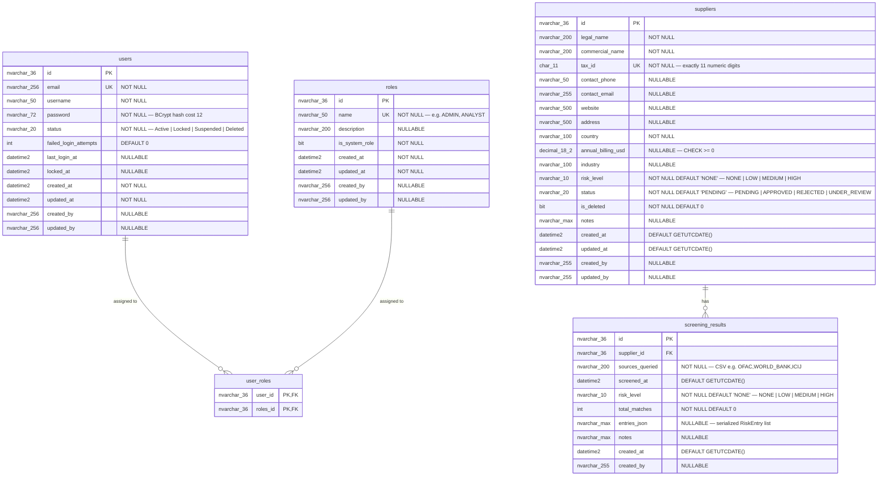

# Database Schema

> Entity-Relationship Diagram and table definitions for the Risk Screening API database.
>
> **Database:** SQL Server 2022
> **Migration tool:** DbUp `7.2.0` — versioned SQL scripts (`V001__...sql`) embedded in the assembly and executed at API startup.

---

## Entity-Relationship Diagram

---

## Table Definitions

### `roles`

Stores system roles. Seeded at startup (`ADMIN`, `ANALYST`).

| Column | Type | Nullable | Constraints | Notes |
|--------|------|----------|-------------|-------|
| `id` | `NVARCHAR(36)` | No | PK | `NEWID()` default |
| `name` | `NVARCHAR(50)` | No | UNIQUE | e.g. `ADMIN`, `ANALYST` |
| `description` | `NVARCHAR(200)` | Yes | — | Human-readable description |
| `is_system_role` | `BIT` | No | — | System roles cannot be deleted |
| `created_at` | `DATETIME2` | No | — | Set by EF Core on save |
| `updated_at` | `DATETIME2` | No | — | Set by EF Core on save |
| `created_by` | `NVARCHAR(256)` | Yes | — | Username from JWT claim |
| `updated_by` | `NVARCHAR(256)` | Yes | — | Username from JWT claim |

---

### `users`

Stores user accounts. Seeded with a default `admin` user at startup.

| Column | Type | Nullable | Constraints | Notes |
|--------|------|----------|-------------|-------|
| `id` | `NVARCHAR(36)` | No | PK | |
| `email` | `NVARCHAR(256)` | No | UNIQUE | Lowercase, validated |
| `username` | `NVARCHAR(50)` | No | INDEX | Alphanumeric + underscore |
| `password` | `NVARCHAR(72)` | No | — | BCrypt hash, cost factor 12 (BCrypt max length) |
| `status` | `NVARCHAR(20)` | No | CHECK | `Active` \| `Locked` \| `Suspended` \| `Deleted` |
| `failed_login_attempts` | `INT` | No | DEFAULT `0` | Locked after 5 consecutive failures |
| `last_login_at` | `DATETIME2` | Yes | — | UTC timestamp |
| `locked_at` | `DATETIME2` | Yes | — | UTC timestamp |
| `created_at` | `DATETIME2` | No | — | Set by EF Core on save |
| `updated_at` | `DATETIME2` | No | — | Set by EF Core on save |
| `created_by` | `NVARCHAR(256)` | Yes | — | Username from JWT claim |
| `updated_by` | `NVARCHAR(256)` | Yes | — | Username from JWT claim |

---

### `user_roles`

Many-to-many join table between `users` and `roles`.

| Column | Type | Nullable | Constraints | Notes |
|--------|------|----------|-------------|-------|
| `user_id` | `NVARCHAR(36)` | No | PK, FK → `users.id` | |
| `roles_id` | `NVARCHAR(36)` | No | PK, FK → `roles.id` | |

> Composite primary key: `(user_id, roles_id)`

---

### `suppliers`

Stores supplier records managed by compliance officers.
Soft-delete uses `is_deleted = 1` — independent of the business workflow `status` field.

| Column | Type | Nullable | Constraints | Notes |
|--------|------|----------|-------------|-------|
| `id` | `NVARCHAR(36)` | No | PK | `NEWID()` default |
| `legal_name` | `NVARCHAR(200)` | No | — | Legal entity name (razón social) |
| `commercial_name` | `NVARCHAR(200)` | No | — | Commercial or trade name |
| `tax_id` | `CHAR(11)` | No | UNIQUE, CHECK | Exactly 11 numeric digits (RUC) |
| `contact_phone` | `NVARCHAR(50)` | Yes | — | Primary contact phone |
| `contact_email` | `NVARCHAR(255)` | Yes | — | Primary contact email |
| `website` | `NVARCHAR(500)` | Yes | — | Company website |
| `address` | `NVARCHAR(500)` | Yes | — | Registered address |
| `country` | `NVARCHAR(100)` | No | — | Country of registration |
| `annual_billing_usd` | `DECIMAL(18,2)` | Yes | CHECK `>= 0` | Annual billing in USD |
| `industry` | `NVARCHAR(100)` | Yes | — | Industry sector |
| `risk_level` | `NVARCHAR(10)` | No | CHECK, DEFAULT `'NONE'` | `NONE` \| `LOW` \| `MEDIUM` \| `HIGH` |
| `status` | `NVARCHAR(20)` | No | CHECK, DEFAULT `'PENDING'` | `PENDING` \| `APPROVED` \| `REJECTED` \| `UNDER_REVIEW` |
| `is_deleted` | `BIT` | No | DEFAULT `0` | Soft-delete flag — independent of compliance status |
| `notes` | `NVARCHAR(MAX)` | Yes | — | Optional analyst notes |
| `created_at` | `DATETIME2` | No | DEFAULT `GETUTCDATE()` | |
| `updated_at` | `DATETIME2` | No | DEFAULT `GETUTCDATE()` | |
| `created_by` | `NVARCHAR(255)` | Yes | — | Username from JWT claim |
| `updated_by` | `NVARCHAR(255)` | Yes | — | Username from JWT claim |

> Indexes: `IX_suppliers_risk_level`, `IX_suppliers_status`, `IX_suppliers_country`, `IX_suppliers_is_deleted`

---

### `screening_results`

Stores the outcome of each screening run for a supplier.
**Immutable after creation** — no `updated_at` column.

| Column | Type | Nullable | Constraints | Notes |
|--------|------|----------|-------------|-------|
| `id` | `NVARCHAR(36)` | No | PK | `NEWID()` default |
| `supplier_id` | `NVARCHAR(36)` | No | FK → `suppliers.id` CASCADE DELETE | |
| `sources_queried` | `NVARCHAR(200)` | No | — | CSV of queried sources, e.g. `"OFAC,WORLD_BANK,ICIJ"` |
| `screened_at` | `DATETIME2` | No | DEFAULT `GETUTCDATE()` | UTC timestamp of the run |
| `risk_level` | `NVARCHAR(10)` | No | CHECK, DEFAULT `'NONE'` | `NONE` \| `LOW` \| `MEDIUM` \| `HIGH` |
| `total_matches` | `INT` | No | DEFAULT `0` | Total matches found across all sources |
| `entries_json` | `NVARCHAR(MAX)` | Yes | — | Serialized JSON array of matched `RiskEntry` objects |
| `notes` | `NVARCHAR(MAX)` | Yes | — | Optional analyst notes |
| `created_at` | `DATETIME2` | No | DEFAULT `GETUTCDATE()` | |
| `created_by` | `NVARCHAR(255)` | Yes | — | Username from JWT claim |

> Indexes: `IX_screening_results_supplier_id`, `IX_screening_results_screened_at DESC`, `IX_screening_results_risk_level`

---

## Migration Scripts Map

| Script | Description |
|--------|-------------|
| `V001__create_roles_table.sql` | Creates `roles` table |
| `V002__create_users_table.sql` | Creates `users` table |
| `V003__create_user_roles_table.sql` | Creates `user_roles` join table |
| `V005__create_suppliers_table.sql` | Creates `suppliers` table |
| `V006__create_screening_results_table.sql` | Creates `screening_results` table |

> V004 was reserved for the `api_keys` table (API Key authentication) which was removed from scope.
> DbUp handles gaps in version numbers gracefully — scripts are tracked by filename, not by sequence number.
>
> All scripts are embedded as `EmbeddedResource` in the assembly and executed by DbUp at API startup.
> See [ADR-0004](../adr/0004-sql-migration-scripts.md) for the full migration strategy.
